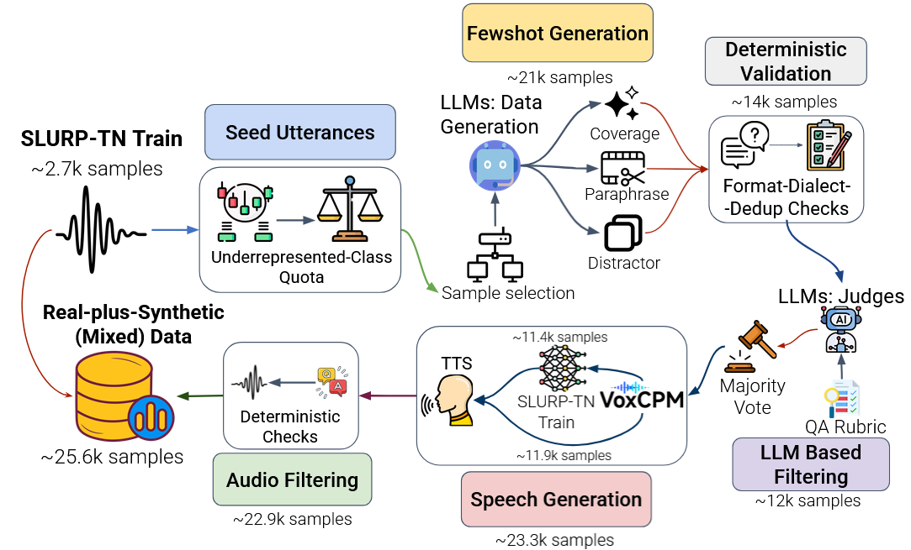

# Aslema @ NADI-2026 Shared Task 5 — Spoken Language Understanding for Tunisian Derja

Code for our system paper: zero-shot and LoRA-fine-tuned audio LLMs for
**intent recognition** (Subtask 5.1) and **slot filling** (Subtask 5.2) on
[SLURP-TN](https://huggingface.co/datasets/elyadata/SLURP-TN), plus the
**LLM + TTS synthetic augmentation pipeline** that produced our submitted system.

Submitted system: **Qwen3-Omni-30B-A3B**, one LoRA adapter trained jointly on both
subtasks for two epochs over *real train + synthetic* data.
Official blind test: **1st in slot filling**, **4th of 8 in intent recognition**.

---

<p align="center">
  
</p>
<p align="center"><em>The synthetic data pipeline: few-shot generation &rarr; deterministic validation &rarr; 3-model judging &rarr; voice-cloned TTS &rarr; acoustic screen.</em></p>

## What is here

```
config.sh                 all paths / models / cluster settings in one place — source this first
common.sh                 shared runtime env (caches, conda, modules) sourced by every job script
prompts.txt               EVERY prompt used, in one file (task, open-inventory, augmentation)
requirements.txt          python deps (TTS installs into its own venv, see augmentation/tts/)
docs/                     pipeline figure
prompts/                  prompt builders the ms-swift jsonls are generated from
data_prep/                SLURP-TN -> manifests -> ms-swift jsonls (+ 60-label open-inventory variant)
augmentation/             synthetic data pipeline (generation -> judging -> TTS -> screening -> manifests)
training/                 LoRA SFT (ms-swift), adapter merge, Whisper-small baseline
inference/                vLLM batch inference (zero-shot + merged adapters), Whisper inference
eval/                     official scorers (accuracy / F1 ; WER / CER / CoER / CVER), submission packaging
```

Everything is driven by environment variables and `#SBATCH` headers; on a
non-Slurm machine, run the underlying `python` / `swift` command inside any script
directly.

## Setup

```bash
git clone https://github.com/hunzed/aslema_nadi2026 && cd aslema_nadi2026
source config.sh                      # edit SLURM_ACCOUNT / CONDA_SH / ENV_NAME first
conda create -n aslema python=3.11 -y -c conda-forge --override-channels
conda activate aslema && pip install -r requirements.txt
```

## Reproducing the paper

**1. Data preparation** — downloads SLURP-TN, writes manifests, label inventories
and the per-family ms-swift jsonls (inference + SFT targets):

```bash
sbatch data_prep/prepare_slurptn.sh
```

**2. Zero-shot inference** (Table 2) — any of the four backbones:

```bash
sbatch --export=ALL,MODEL=Qwen/Qwen3-Omni-30B-A3B-Instruct,MODEL_NAME=qwen3_omni_30b_a3b,\
FAMILY=qwen,SUBTASK=intent,SPLIT=test inference/infer_finetuned.sh
```

**3. LoRA fine-tuning** (one adapter, both subtasks, two epochs) then merge and
re-infer:

```bash
sbatch --export=ALL,MODEL=Qwen/Qwen3-Omni-30B-A3B-Instruct,MODEL_NAME=qwen3_omni_30b_a3b,\
FAMILY=qwen,SUBTASK=joint,NUM_EPOCHS=2 training/sft_lora.sh
sbatch --export=ALL,CKPT=<checkpoint dir> training/merge_lora.sh      # 30B: manual_merge_lora.sh
sbatch --export=ALL,MODEL=<merged dir>,MODEL_NAME=<slug>_sft,FAMILY=qwen,SUBTASK=intent,\
SPLIT=test inference/infer_finetuned.sh
```

Recipe (identical for every model): LoRA rank 16, alpha 32 on the language
backbone's `q,k,v,o_proj`; audio encoder and audio–text aligner frozen;
lr 1e-4; effective batch 8; max length 4096; bf16; 2 epochs; final checkpoint served.

**4. Whisper-small baseline** — full fine-tune, 2 epochs, `[INTENT]`/`[SLOT]`
marker forced at decoding:

```bash
python training/train_whisper.py --joint --epochs 2 --lr 1e-5 --batch 16
python inference/infer_whisper.py --model-dir <dir> --subtask intent --split test --joint
```

**5. Scoring** — the organizers' metrics:

```bash
sbatch eval/eval_all_intent.sh      # accuracy, macro-F1, weighted-F1
sbatch eval/eval_all_slot.sh        # WER, CER, CoER, CVER
```

**6. Official test set + abstention.** The blind test is scored over the full
60-label SLURP inventory, which the released 23-label prompt cannot express.
`data_prep/make_open_inventory_infer.py` rewrites the test jsonl with the
60-label + `unknown` prompt (Part 2 of `prompts.txt`); the abstention rule that
folds the catch-all `general_quirky` into `unknown` is
`eval/make_intent_submission_quirky2unk.py`.

## Synthetic data augmentation

See [`augmentation/`](augmentation/) — full detail in
[`augmentation/README.md`](augmentation/README.md). Summary of what runs:

| stage | tool | output |
|---|---|---|
| quotas from label frequency (more data for rarer intents) | `seed_pool.py` | per-intent quotas + few-shot seeds (**train split only**) |
| few-shot generation, 3 modes (coverage / paraphrase / distractor) | `generate.py` | 20,937 raw candidates |
| deterministic validation (grammar, label inventory, script ratio, length, near-dup) | `validate.py` | 13,876 |
| 3-model judging panel, keep on 2-of-3 majority | `judge.py` | **12,138 utterances** |
| voice-cloned TTS, base **and** SLURP-TN-LoRA VoxCPM2, shared 152-clip reference pool | `tts/` | 23,300 renditions |
| deterministic acoustic screen (duration, level, clipping, activity, speaking rate) | `build_manifests.py` | **22,940** (+2,677 real = 25,617 mixed) |

The acoustic screen is the **only** filter applied to the synthetic audio; no
per-clip LLM authenticity check was run (a 650-clip listening study was used only
to pick the base TTS variant for the mixed set).

## Citation

```bibtex
@inproceedings{aslema2026nadi,
  title     = {Aslema at NADI 2026: Augmentation through Fewshot for SLU},
  booktitle = {Proceedings of the NADI 2026 Shared Task},
  year      = {2026}
}
```

## Acknowledgements

Built on [ms-swift](https://github.com/modelscope/ms-swift),
[vLLM](https://github.com/vllm-project/vllm),
[VoxCPM](https://github.com/OpenBMB/VoxCPM), and the organizers'
[SLURP-TN baselines](https://github.com/elyadata/SLURP-TN-baselines).
